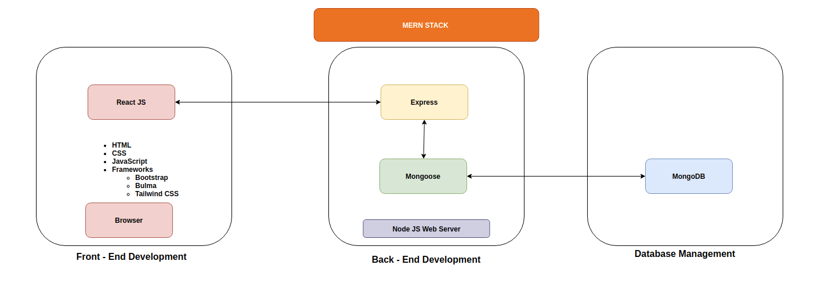

# **Workbook - T3A1 - Nathan Blaga**

## **NathanBlaga_T3A1 - GitHub Repo:** https://github.com/NJBLAGA/NathanBlaga_T3A1

## **Q1 - Provide an overview and description of a standard source control process for a large project.**

“Source control (or version control) refers to tracking and managing changes to code. This ensures that developers are always working on the right version of source code” (Gehman 2019). A good source control workflow relies on several key characteristics;
- a sound source control management system,
- committing changes often,
- utilising branches for different features,
- optimising workflow through remote repositories.

“Source control management (SCM) refers to tools that help you keep track of your code with a complete history of changes” (Gehman 2019). A development team should designate a SCM which best suits their needs (Kadivar 2018).
According to Altassian’s tutorial on version control, there are primary benefits common to all source control systems. Three main benefits mentioned in the article, include but are not limited to;

### **File History:**
Assuming the project was uploaded to the system from inception, systems such as GitHub track the full history of the project. This is extremely helpful for new developers brought onto the project. This feature allows any developer or individual viewing said page to have a backlog of all files, including their creation, updates and even deletion.

### **Traceability:**
As mentioned above, the ability to view a project’s history allows a more in-depth understanding on how the code has been developed over time, the source for certain alterations and ultimately the direction the project has taken through its development cycle and features sprints.

### **Branching and Merging:**
The ability to branch a project into various streams and merge them back together serves as a vital foundation for why source control is critical to any project, large or small.
The following example represents how a development team would approach a large project while utilising a good source control practice through GitHub. NB studios have been assigned with creating a new web application for one of their larger clients. The development team consists of 15 team members whose task is to develop and release the product. They are also required to overlook its continuous deployment, regular updates and hotfixes in addition to developing, testing and integrating new features. The project utilises GitHub as its version control system.


The above diagram depicts at a basic level the structure of the project's Gitflow. The project is initiated with the creation of the main branch. This initial branch contains a basic skeleton of the project in conjunction with any specs or requirements outlined within its documentation. The main branch is then cloned to various other development branches, each responsible for different features and substructures within the project’s overall design. Once the development branch has successfully achieved its desired outcomes, it is reviewed, tested and approved to be merged back into the main branch (Levit 2018). Once merged, the new production main branch becomes the current version of the project. The main branch is then cloned and new development branches are initialised. The development cycle of a new feature is then commenced, ensuring the above procedures are followed. The process is then repeated until a minimal viable product (MVP) is developed and ready for deployment.


The above diagram illustrates how a single developer within the team would handle the Gitflow of their development branch. Referencing back to the key characteristics of any good source control workflow, it is vital to commit changes often once the developer feels the code is functioning correctly without error. This ensures that if any files are lost or corrupted, the developer can clone a working viable version of their repo back to their local device and continue with their respected branch.

Once an MVP has been established and deployed, there is a process that must be followed for the integration of new features and continuous deployment of the web application.


As shown above, the main branch represents the live version of the web application. Once a new feature has gone through early development and approval, the team is ready to undertake its development sprint. The feature branch is created and the development cycle begins, utilising the Gitflow steps mentioned above. Once the code for a particular feature branch has been developed and tested, it is pushed to GitHub for review and feedback. “The code review process is added to ensure all marges of features branches are well developed, tested and, even desired” (Kadivar 2018).

 If the current state of the feature pushed to GitHub fails to meet the required standards, it is reverted back to the development and testing stage once again. However if the feature is determined to be classified impracticable or no longer beneficial to the client, the branch is then terminated and the developers are reassigned to other features. If the proposed changes are viable and accepted, they are merged with the main branch and integrated with the live version, creating a new release of the web application. The process then begins again for any new features and their development sprints. “Branching and merging also allows for many features to be developed simultaneously without disturbing the applications live functionality and structural integrity. Additionally the development team will notice a decrease in conflicts of code between the live version and the features being developed” (Atlassin).

## **Q2 - What are the most important aspects of quality software?**

“Software quality is defined as the ability of the software to function correctly and satisfy all of its requirements. The requirement of software can be classified as either functional or non-functional” (Maayan). Functional requirements encompass what the software is capable of doing and what it should do. Maayan’s blog lists the following examples of what can be categorised as functional requirements;

- calculations
- technical details
- data manipulation and processing

Non-functional requirements also known as “quality attributes'' encompass how the software’s system should work. Software attributes include but are not limited to;

- disaster recovery protocols
- system portability
- its privacy and security
- its supportability and usability

 “A software engineer’s ability can be measured by the quality of the software he or she creates” (Reinagel 2016). To measure and judge any software product’s quality, we must first look at the underlying key aspects that ultimately form high levels of software quality. “The following aspects can be measured and judged for any software product” (Reinagel 2016).

### **Reliability:**
When software correctly functions and performs tasks and procedures as intended with little to no errors, the software is considered to be highly reliable. Moreover if any errors do occur, said errors should be handled in a practical and elegant style (Reinagel 2016). An example would be of a banking application that on command, withdraws, deposits, transfers and displays a user’s current account details. The software always performs its tasks without question, and never alters the output of the user’s intentions.

### **Understandability:**
For software to satisfy the aspect of understandability, it should function and behave the way any developer expects it to do so. Everything that comprises the software from its source code, its infrastructure, varying components and framework should be easy to understand at a simplistic and approachable level (Reinagel 2016). For example, a junior developer has never worked on the product before or studied its source code. However from the moment he/she opened the code up, they found it easy to read, understand and process what the software is doing and how it is performing the tasks required of it.

### **Modifiability/Maintainability:**
Software systems should be modified and maintained by the developers overseeing its various iterations over its life cycle with ease and minimal conflicts. This can be achieved by the source code adopting a DRY architectural design pattern with consistent rules and practices evident throughout the code base. This in turn should result in a software system requiring fewer lines of code to be changed in order to alter a particular behaviour or function (Maayan).

### **Usability:**
Software products should not require convoluted and unnecessary configuration or extensive expertise and knowledge to use the product. The user interface (UI) is critical to a product's success as it is the point of contact between the software and user. Using the banking application as an example, the UI should approach the user with a simplistic user-friendly design, easy navigational tools alongside the fast execution of functions and tasks with little to no errors (Reinagel 2016).

### **Testability:**
Testing is a critical element of software development and helps to ensure that the functionality of a software product is meeting user expectations and satisfying stakeholder requirements. Today Test Driven Development (TDD) has become a staple of most developer toolkits. By testing software from its inception, this allows developers to gain a better insight into the software’s structure and functionality. When software is highly testable and its functionality can be easily verified, this allows for faults, bugs and errors to be easily identified and eventually fixed. From its inception, the banking application was developed under a TDD mindset and so through every iteration of its life cycle, extensive tests were written to correctly gauge its performance and functionality. Its release was greeted by one small bug that was quickly identified and patched two hours after release.

### **Efficiency:**
Efficient software should perform its primary tasks in a time efficient manner, using as few physical resources as possible. This implies the software minimises the number of calls it makes to the database, the overall consumption of battery life, reduction in CPU cycles and an overall strain on the machine being run on (Reinagel 2016). The banking application is considered an efficient software product as it ensures that it does not hinder the performance of other softwares being run alongside it or in the background.
### **Security:**
In today’s modern era of cybercrimes and software manipulation, it is critical that a software product can reassure its stakeholders and users that it has reliable security systems and protocols in place. “The quantity and severity of vulnerabilities found in a software system are indicators of its security level. Poor coding and architectural weaknesses often lead to software vulnerabilities” (Maayan). The banking application follows strict guidelines and upholds the privacy and protection of its user’s data and private information. This is achieved through authentication procedures, password encryption technology and ongoing screening of possible weaknesses or vulnerabilities in the code itself.
It should be noted that not all of the above quality aspects are needed for all software products. The prioritisation of particular aspects of quality should vary depending on the nature of the software system. The development team must understand the project’s requirements and nature to research, understand and enforce the aspects of quality that are imperative to their project’s success (Reinagel 2016).

## **Q3 - Outline a standard high level structure for a MERN stack application and explain the components.**

The MERN Stack is a collection of JavaScript technologies used to develop full-stack web applications in an efficient and effective manner. “The term stack can be explained as a combination of programming languages, technologies, or software products” (Editor 2020).
The fundamental concept behind the MERN Stack is to easily and quickly construct and develop a 3-tier architecture using JavaScript and JSON. These three tiers consist of the Front End (Web), Back End (Server) and the Database (Jasraj 2020). The name MERM stands for the following four technologies;

- MongoDB (Document database)
- Express.js (Node.js web framework)
- React.js (Client-side JavaScript framework)
- Node.js (Premier JavaScript web server)

According to Mobinius Editor 2020, developers who utilise the MERN Stack for their projects do so with various benefits in mind. The MERN Stack provides excellent support for working within a Model View Controller (MVC) architecture. Through the use and access of various frameworks and libraries, most of the grunt work is simplified and easily manageable. Popular testing tools are built within the technologies. One great example is that of Jest within node.js allowing developers to undertake a Test Driven Development approach from the initial inception of the project. The MERN Stack uses open-source frameworks, which in turn allows for customisation, detailed documentation and community support.




As shown above, The MERN Stack is divided into three tiers, each with their own functions and differing components. Understanding each tier and the technologies that encompass them will help in better understanding how the Stack operates as a whole.

### **Front End (Web Tier) – React.js:**
React is an open source JavaScript library which allows developers to build complex interfaces through simple components. It also has the ability to connect them to data in a backend server. Once connection is established, React can then render the data as HTML back to the front end and onto the user’s browser (Carnes 2019). React brings many benefits to the table including its ability to create and handle multi-state data-driven interfaces with minimal effort and code needed. Moreover, as a framework it provides outstanding “support for forms, error handling, events, lists and more” (Carnes 2019).

### **Back End (Server Tier) – Express.js, Mongoose and Node.js:**
“Express.js is a minimalist web framework for Node.js, and handles HTTP requests and responses between the server and the browser” (Carnes 2019). “Mongoose is an Object Data Modelling (ODM) library for MongoDB and Node.js” (Karnik 2018). Its main functions are to manage data relationships, alongside translate and transform database representation of objects found in the code into MongoDB. Node.js creates an environment for API generation and executes all code located on the server side.

### **Database Tier – MongoDB:**                                                                                                               
MongoDB provides many benefits when implemented into a project built on a MERN Stack. It is especially powerful due to its ability to store data in JSON documents alongside dynamic schemas rather than the conventional rows and columns found in a relational database. This works hand in hand with the front end, as any JSON documents created in React.js can be sent through the Express.js server and straight into the MongoDB database. This allows a very strong connection and establishes a more efficient and effective flow of data within the stack (Simplified 2020).

The below diagram illustrates how each component of the MERN Stack functions within the MVC architecture and the interactions between the components themselves. Further analysis will be discussed through the banking application example from previous questions.


A user wishes to transfer some funds to a family member. They decide to log onto their phone and make the request. The moment the user enters their username and password, a HTTP request is sent to the server (Node.js server) which is then routed to the controller (Express.js). Mongoose is then instructed to translate objects within the HTTP requests into their database counterparts. Through the model and CRUD functionality of the application, Mongoose queries the database (MongoDB) and extracts the relevant data needed (does the user exist? If so, gain access to their information and account details). Mongoose then translates the retrieved data back into objects and sends them to the controller. Express.js then directs the user information back to the view (React.js). 

The controller instructs the view on how to present the information allowing React.js to render the information into HTML and CSS. In some instances, CSS frameworks such as Bootstrap, Bulma or Tailwind can be implemented into the front end to bolster the appearance of the application. The rendered page is then sent back to the Browser or device and the user is directed to their account page, or given an error and prompted to login again. An application built upon the MERN Stack within an MVC architecture can be very powerful, efficient and effective at performing and satisfying stakeholder and user requirements.

## **Q4 - A team is about to engage in a project, developing a website for a small business. What knowledge and skills would they need in order to develop the project**

Upon engaging in the development of a website for a small business, a development team should consider various skills and knowledge required of each team member to complete the project. Various other elements must also be examined, tested and integrated into the team's management strategy to maximise the efficiency and effective behaviour of the team and the project.

The team can initialise this process by implementing an Agile Methodology style of management. “Agile project management is an interactive approach to managing software  development projects that focuses on continuous releases and incorporating customer feedback with every iteration” (Drumond). The team then cycles through the process of planning, executing, and evaluating the best processes and technologies required to complete the website in the most efficient and effective manner. Team management also needs to ensure that the team as a whole understands what is required of them. In addition, the following steps should be addressed and examined by the team to better integrate an agile methodology into their software development practices. These steps include:

1. What is right for the team? (Evaluating the team’s and individual’s strengths and weaknesses).
1. Project vision and scope? (What is the end goal of this project?)
1. Creating and following release plans.
1. Plan for each sprint efficiently and effectively.
1. Perform daily standups (Address and formulate solutions to all blockers).
1. Review each sprint (Question the effectiveness of each sprint and improve for future sprints). 

Great communication skills are vital to maximising the team’s efficient and effective behaviour in achieving the above steps. Internally, the team and management must be able to express their visions, outlook and concerns with each other to better understand the current state of the team's mindset, process and approach to the project at hand. Moreover, the team must have the ability to communicate with the client in a strong, consistent and systematic fashion.  Understanding the client’s wishes and intentions for the website can help indicate to the development team the future outlook of the website. This requires the development team to predict and plan the possible reach of the website in terms of scalability. 

Each team member must be comfortable and familiar in using an agile ticket system such as  trello board for assigning each task to different individuals. Each task or ticket will encompass a timeframe and urgency in which team members must apply their own time management skills and experience to balance and allocate sufficient time and resources. Each individual must be able to contribute to the development of initial sitemaps and wireframes, and convey the client’s requirements and needs in the final product. This allows developers to align their projections and goals with that of the clients, resulting in a more synchronised vision of the website as a whole. 

The development team should have a strong understanding of using source control such as git locally and remotely. The team should decide on a source control management system such as GitHub or GitBucket to utilise. Each member should feel comfortable and experienced in pushing, pulling, merging, branching and cloning project files.

Furthermore, the development team must ensure that their team members possess the required skills in HTML, CSS and JavaScript to fulfill the project's goals. While these are the core technologies within the project’s stack, more in depth customisation can be achieved. The team must also have the necessary skills to utilise particular frameworks if required such as Bootstrap or Bulma, React.js or Angular, to name a few. 

Another vital aspect of understanding the client’s requirements involves the website having the capacity to facilitate user profiles, login systems, or data and information being stored. If this is the case, the team must be comfortable and skilled in developing and implementing a backend. This entails utilising a database such as MongoDB, MERN Stack or the various other popular and powerful databases available. The team would have to consider the structure of the website and may wish to use a Model Controller View (MVC) architecture to produce a more efficient and effective website for their client. If this is the case, team management must ensure that each individual has a familiar understanding of how the differing components of an MVC architecture work. 

Following the aspects of high quality software, the team should ensure the testability of the website, using a clean DRY conformed code base. Each team member must be comfortable in developing the website with a Test Driven Development structure, mobile first design alongside making sure it has compatibility on most browsers and devices. Finally, the protection and security features of the website must prevent any user data or private information (if present) from being accessible to non-users or linked outside of the domain of the website. More importantly, the website's infrastructure must prevent and protect the clients and users from hackers and cybercrime. To ensure this, the development team must have the knowledge and skills to develop the website with minimal to no variabilities and faults.

To efficiently and effectively develop this website, a development team must formulate a structured plan and development cycle with feature sprints and well organised collaboration between team members and the client themselves. Moreover, the development team must research, examine and understand the requirements and needs of the clients to better identify the underlying skills and knowledge needed to complete the project.

## **Q5 - 	With reference to one of your own projects, discuss what knowledge or skills were required to complete your project, and to overcome challenges.**

Early this year, I was asked to develop and deploy a two sided marketplace which resulted in the creation of Workout Jungle. The original intention of Workout Jungle was to provide a marketplace in which Australian consumers could buy and sell new and used fitness equipment.

The minimal requirements of the projects instructed that the web application must be developed with the following specifications:

- Ruby on Rails
- PostgreSQL Database
- Authentication
- Authorisation
- File uploading capability
- Deployment 

From the project's inception, it was designed, developed, tested and deployed with an agile methodology and mindset. This required me to be familiar with the idea of agile development. From the onset, research was instigated with the purpose of understanding the market and the need for such a product. This required me to have the knowledge of examining a real world situation and develop a formulated solution to an ongoing problem by examining user stories. I was required to possess the necessary skills and tools to not only extract realistic requirements out of the users, but to also translate them into features, functions and founding elements of Workout Jungle’s infrastructure.

The next stage involved designing the following elements:

1. A sitemap
1. Wireframes
1. ERD

Thankfully through the course’s structure, past experiences and further research I had conducted, I found myself possessing the capabilities and knowledge needed to create all three elements for my project. Having designed sitemaps and wireframes in the past lended greatly towards the project, allowing me to develop sound and effective designs. Entity Relationship Diagram (ERDs) were a relatively new concept at the time of the project. Due to ERDs having a great influence in the development of databases, it was important for me to overcome this challenge and undertake further research into understanding them.

Once I had a firm grasp on the design and structure of the project, it was time to begin developing the application itself with Ruby on Rails. Although I had been familiar with the language Ruby for several months, I was relatively new to utilising ruby within the Rails framework. This was one of the major challenges throughout the project, understanding the Rails framework within a Model Controller View (MVC) architecture. This in turn required me to have an extensive and sound understanding of the components within the project's architecture. The same consideration and resources were handled with understanding PostgreSQL’s relational database structure and formatting. Without the knowledge to create, implement and populate data within the database, in combination with the skillset to access data through the model and controller and render it to the views, it would have been impossible to develop the project and satisfy user requirements. Developing this project with the idea of utilising Ruby on Rails in conjunction with a PostgreSQL database was a very challenging yet rewarding task.

Having the knowledge and skill set to utilise Ruby on Rails’ extensive gem library allowed me to further enhance the overall functionality of the web application. By obtaining and furthering my knowledge of the Devise gem, I was able to implement user authentication and provide a level of security that satisfied user requirements. The ability to shape the user and listing controllers allowed me to implement authorisation to certain pages and create an extra level of privacy and protection for all users of the site. Utilising my skills and knowledge within Rail gems such as simple_form and kramdown allowed me to also enhance the user experience of sign in/up/out pages and the site's messaging system.

In relation to the front end (views - in regards to the MVC model), my knowledge and skill set in HTML and CSS aided in developing a user-friendly and mobile first design. Although at the time of the project, my skills in JavaScript were limited, I had decided to develop and enhance them, which in turn strengthened my site's overall functionality. This aided in my ability to integrate the CSS framework Bootstrap into my project. Source control and Git flow was another vital aspect to the project. My knowledge and understanding of best practices in committing often and branching for new features allowed me to navigate through the various feature sprints without hassle or much concern.

Finally, the utilisation of third party software such as Cloudinary and Heroku allowed me to further enhance the capabilities and functionality of Workout Jungle. Having prior basic knowledge in the Cloudinary Platform from class alongside my own personal research allowed me to implement a cloud based storage system that allowed the web application to store and access on-demand images uploaded by users of the site. While having limited experience with Heroku, further research and development was required for this project. In turn, Heroku allowed Workout Jungle to be deployed continuously while its development cycle was still occurring. Heroku also caused many challenges throughout the project's development cycle and required continuous development in my knowledge of the platform. Overall, a combination of my developed skills and knowledge alongside further development and research aided in my ability to develop Workout Jungle in an efficient and effective agile manner.

## **Q6 - With reference to one of your own projects, evaluate how effective your knowledge and skills were for this project, and suggest changes or improvements for future projects of a similar nature.**


As mentioned above, a variety of skills were implemented and utilised in developing Workout Jungle. The overall effectiveness of the web application itself can be directly attributed to how effective my skills and knowledge of each technology and individual components were.

Although I had an efficient and basic understanding of Ruby as an individual language and within the Rails framework, a critical remark would be my lack of more advanced knowledge and skills within the framework as this disadvantaged my overall ability to develop a more efficient and viable application. Likewise, my lack of knowledge of the inner workings of the MVC architecture limited my scope of the full potential offered by the model. Although it was my first project using Ruby on Rails and an MVC architecture, better utilisation of its documentation and more efficient preparations would have produced a more desirable outcome. The same remarks can be made on the implementation of PostgreSQL. Having limited experience with a relational database resulted in the project not gaining the full benefits of utilising such a powerful tool. Overall, the knowledge and skills displayed between Ruby on Rails and PostgreSQL within an MVC architecture was sufficient to design, develop and deploy a viable solution to an ongoing problem.

In regards to the front end of the project, my skill level and knowledge base of HTML, CSS and JavaScript was sufficient enough to produce a user-friendly, mobile first design which met user expectations and requirements. However for future reference with similar projects, CSS frameworks such as Bootstrap will be replaced with more modern technologies such as Tailwind CSS or even substituted completely for custom vanilla CSS. Likewise, with further development into my knowledge and skill set of JavaScript, this will allow me to draw upon frameworks such as React.js or Angular to be integrated within projects. 

Drawing upon the overall state of the final product and the agile development mindset used to approach its development, Workout Jungle established key elements of design that were effectively implemented from initial design through development. The skills and knowledge used for the original sitemap and wireframes were very well thought out and in turn produced an effective and clear vision on the manner in which the web application should function and behave for its users. Having a grounded and clear understanding on the structure of the relations between entities within the database allowed for an easier development stage of the database, alongside the model and controllers within Rails. Although my knowledge and developed levels in the above skills highlight the effective functionality of Workout Jungle, by no means are they perfect. My intentions are to improve in all areas of design for future projects which in turn will grant myself the ability to develop software with a clearer vision and understanding.

Future endeavors to improve my agile methodology for development is to instill a more strict approach and focus on Test Driven Development. A decision was made to not implement the Rails gem Rspec and undertake a TDD approach on Workout Jungle on the simple notion that I felt it was one of my weaker skills as a developer. In turn, the effective functionality and nature of the web application was heavily diminished. Without sufficient testing, no piece of software can achieve a high level of quality and becomes vulnerable to errors, bugs and malicious attacks. Improvements for future projects entail a more comprehensive understanding of TDD and testing in general.

Workout Jungle was deployed on the cloud based server Heroku. Moreover, the web application allowed users to store and access uploaded images which was possible through Cloudinarys cloud based storage service. Furthermore, these third party services were not fully utilised due to my inexperience and lack of advanced knowledge on the two services. With greater understanding of their documentation, further research and experience with the services, future projects will benefit more from the implementation of such technologies. 

Finally, the overall structure and mindset in which I approached the project was one of focus and detail. It allowed me to combine various front end and back end skills in combination with relational database knowledge. However, various underlying issues reduced the effective nature of my development cycle. Although time management of each feature and process was detailed in a trello board and accounted for within the logged tickets, unexpected issues and bugs caused a delay in development. While this is a normal occurrence in the tech industry, it allowed me to obtain a clear understanding of my current abilities. Throughout Workout Jungle’s development, unexpected errors caused me to doubt the process and my skills which in turn caused a lower productivity output. These doubts and errors arose from my lack of understanding and knowledge paired with undeveloped skills in particular areas. Moving on towards future projects and my own progression as a developer, it is key to take these lessons and use them to strengthen my resolve, skills and knowledge to prevent drops in productivity or work ethic.

## **Q7 - Explain control flow, using an example from the JavaScript programming language.**

The normal flow of a program usually reads code like a story, from top to bottom.

```js
let myName = "Nathan"
console.log(`Hello, ${myName}!`)
console.log("Hope you are having a nice day!")
```
Examining the above code we can see that when the code is executed, the program will read the variable ```name``` being assigned to the string ```”Nathan”```. The program then reads down the script/file and then console logs the message: ```Hello, Nathan!``` followed by the next line of: ``` Hope you are having a nice day!```. Here we observe the natural or normal flow of code being executed.

Control flow plays a vital role in software development and web development. “Control flow is the order in which a program executes statements in a script or file” (Jude 2018). Control flow statements are those that make decisions about what happens in a program. Most languages including JavaScript have two types of control statements; conditional statements and iterative statements (Choudhary 2019).

Conditional statements make decisions based on particular expressions or parameters passed through the code. These statements end with the program arriving at a decision based on a true or false, yes or no verdict (More). Conditional statements are also referred to as IF statements, switch statements or ternary operators. An IF statement consists of three main components, ```if```, ```else if``` and ```else```. 

```if``` Checks for a specific condition. If true, it will be executed.
```else if``` Extended version of ```if```, when ```if``` is not true or is not satisfied, then the program moves down the code and checks if the ```else if``` is satisfied. If true, it will be executed.
```else``` Checks if a block of code is to be executed. This usually amounts to false when the ```if``` statement is true.

```js
function addNumbers(a,b) {
    c = a + b
    if (!isNaN(c)  && c % 2 === 0) {
        console.log(`The answer = ${c}, which is an even number.`)
    } else if(!isNaN(c) && c % 2 !== 0) {
    console.log(`The answer = ${c}, which is an odd number.`)
    } else  {
    console.log(`a and b need to be numbers, please try again!`)
    }
}
console.log(addNumbers("hello",2))
```
The function ```addNumbers``` takes two arguments; ```a``` and ```b```. It then defines a variable c  to equal the total sum of both ```a``` and ```b```, followed by a conditional statement. If the variable c is a number AND is Modulus by 2 with a even remainder then it is an even number and console logs ```The answer = 4, which is an even number.``` If ```a``` is passed with the value of ```3```, then ```3 + 2 = 5```, the code would go down the conditional statement and see that 5 does not match the first condition, so it moves down and checks it against the else if line. ```5 % 2 = 1```, and so it would execute that line with ```The answer = 5, which is an odd number.``` Finally the ```else``` statement executes if ```a``` or ```b``` are not numbers. If ```a``` was run with the string ```”hello”``` the following would be outputted to the terminal: ```a and b need to be numbers, please try again!```

Similar to an ```if``` statement, a ```switch``` statement is used when a program needs to execute one code out of a multiline code block with various possibilities. “Switch statements carry an expression, which is compared with values of the following cases and once a match is found, code associated with that case executes” (More).

```js
function petSounds(pet) {
    switch (pet) {
        case "dog":
            console.log(`My pet ${pet} goes WOOF WOOF!`)
            break
        case "cat":
            console.log(`My pet ${pet} goes MEOW MEOW!`)
            break
        case "bird":
            console.log(`My pet ${pet} goes TWEET TWEET!`)
            break
        case "snake":
            console.log(`My pet ${pet} goes HISS HISS!`)
            break
        default:
            console.log(`I have never heard of a ${pet} as a pet before?`)
    }
}
console.log(petSounds("dog"))
```
The above function ```petSounds``` takes an argument of a string of an animal/pet name. Inside the function we have a switch statement that contains the expression of ```pet```, this expression is checked and compared with each of the cases. If the expression matches with a particular case, the code block inside that case is executed. The ```break``` statements indicate that once a match is found, the code does not run the rest of the statements and terminates once the matched code block is executed. The ```default``` line works similar to ```else``` however it sets a default block of code to be executed if no matches can be found.

Iterative statements also referred to as loops or loop statements, execute code and repeat specified instructions until a given condition or parameter has been satisfied (More). There are three iterative statements:

### **WHILE:**

A control flow statement that executes a code block repeatedly until the condition is satisfied.

```js
let i = 0
while (i < 5) {
    console.log("Hello, World!")
    i++
}
```
The above code sets a variable of ```i``` to 0, then runs a while loop. The loop instructs the code to run the block of code while ```i``` is below ```5```. So when the program executes the while loop, it console logs ```”Hello, World!”``` to the screen, then increase ```i``` by 1. The loop then returns to the top of the code block and executes the same process over and over again until ```i``` is equal to ```5```, in which the loop is terminated.

### **DO - WHILE:**

“Similar to a while loop, with a twist that keeps a condition at the end of the loop. Also known as Exit Control Loop, DO-WHILE executes the code and then checks for the condition” (More).

```js
let i = 5
do {
    console.log(`T-minus ${i} seconds!`)
    i--
}
while (i >= 1)
console.log(`Blast-Off !!!!`)
```
In the above example of a DO-WHILE loop, the code sets the variable ```i``` to ```5```, the ```do``` block states that the program should run the countdown and reduce ```i``` by 1 every iteration. These two instructions will be carried out until the ```while``` condition of ```i``` is no longer greater or equal to 1, at which point the condition is satisfied and the program executes the blast off line and then terminates the code.

### **FOR:**

“A for loop will execute a code block for a number of times. Compared to other loops, FOR is shorter and easy to debug as it contains initialization, condition and increment or decrement in a single line” (More).

```js
let friendsNames = ["Tom", "Steve", "Jerry"]
for (let i = 0; i < friendsNames.length; i++){
    console.log(`${friendsNames[i]} is one of my Best Friends!`)
}
```
The above example sets the variable of ```friendsNames``` to an array of strings, representing names. A For loop is then executed in which it iterates through the array by variable ```i``` (initialisation) and ends once the code has exceeded the total length of the array (condition). Each pass has the for loop incrementing ```i``` by ```1``` (increment). The code will then display the following output:

```js
Tom is one of my Best Friends!
Steve is one of my Best Friends!
Jerry is one of my Best Friends!
```

## **Q8 - Explain type coercion, using examples from the JavaScript programming language.**

Type Coercion is the process of converting one data type to another (GeeksforGeeks 2020). Type Coercion can be implicit or explicit, the difference being implicit coercion occurs automatically by JavaScript while explicit coercion is explicitly executed through code using the inbuilt functions within JavaScript (FreeCodeCamp 2018).

Whenever JavaScript is given code to execute and there are various operations and processes involving two or more elements in different data types, JavaScript will attempt to convert those elements to the same data type and perform the required actions (Tandon 2020). Below are examples of Implicit Coercion performed by JavaScript inside node.js:

```js
12 + " " // "12" -> JavaScript converts the 12 into a string type, allowing it to add the two strings together.
"12" * 2 // "30" -> JavaScript converts the 15 into a number type, allowing it to multiply the two numbers together.
"10" - 2 // "8" -> JavaScript converts the 10 into a number type, allowing it to subtract the two numbers together.
undefined + 6 // NaN -> JavaScript  cannot convert undefined into a number type, resulting in the output not being a number.
null + 5 // 5 -> JavaScript can convert null to a number type which equates to 0, resulting in 0 + 5
"Hello" + null // “Hellonull” -> JavaScript converts null into a string type and combines both strings together.
true + true  // 2 -> JavaScript converts both true and true to their number type (binary) which equates to 1.
10 * [5] // 50 -> JavaScript converts the 5 within the array into a number type.
```
Explicit Coercion is achieved in the code by the author specifying one of the three inbuilt methods available within JavaScript. These methods include:

- String()
- Number()
- Boolean()

### **Converting to string:**

The ```String()``` method is used to convert any data type value to string values (Tandon 2020). As demonstrated below, the ```String()``` method takes an argument, and once executed, the argument type is converted into its counterpart string type.

```js
String(25) // "25" -> JavaScript converts the 25 from a number type to a string type of "25".
String([]) // "" as [] -> JavaScript converts the [] from an empty array to a string type of empty string "".
String(true) // "true" -> JavaScript converts the true from a boolean type to a string type of "true".
```
### **Converting to number:**

The ```Number()``` method is used to convert any data type value to number values (Tandon 2020). As demonstrated below, the ```Number()``` method takes an argument, and once executed, the argument type is converted into a number type.

```js
Number("334") // 334 -> JavaScript converts the "334" from a string type to a number type of 334.
Number(false) // 0 -> JavaScript converts the false from a boolean type to a number type of 0.
Number(null) // 0 -> JavaScript converts the null number type of 0.

parseInt("22.2") //22 -> JavaScript converts the "22.2" into a number type of 22.
parseFloat("22.2") //22 -> JavaScript converts the "22.2" into a number type of 22.2.
```

As demonstrated above, the ```Number()``` method converts its argument from any data type to a number type with a numeric value.

It should be noted that there are two more methods; ```parseInt()``` and ```parseFloat()```. These methods can also be used to convert numbers stored as a string to a number type. The difference between the two as shown above is that ```parseInt()``` will convert a number with a string type to the nearest full number in number type while ```parseFloat()``` will perform the same action however allow the output to be a float and retain any decimal place characters. “For all other data types, it will return ```NaN```” (Dr. Rauschmayer 2019).

### **Converting to boolean:**

The Boolean() method is used to convert any data type value to Boolean values.

```js
Boolean(32) //true -> JavaScript converts the 32 from a number type to a boolean type of true.
Boolean(null) //false -> JavaScript converts null to a boolean type of false.
Boolean("Hello World!") //true -> JavaScript converts the string of "Hello World!" to a boolean type of true.
```
As demonstrated above, any data type that is used as an argument within the Boolean() method will be converted into the boolean type of true, while any argument that has a falsy value will be converted into the boolean value of false. The following values are considered to be falsy in JavaScript:

- ```false```
- ```0```
- ```-0```
- ```On```
- ```""```, ```''```, ``
- ```null```
- ```undefined```
- ```NaN```
- ```document.all```
- ```&&```

## **Q9 - Explain data types, using examples from the JavaScript programming language.**

“Data types are used to classify one particular type of data in programming languages” (Singh 2018). Data types are defined into two separate categories; primitive and non-primitive (Edureka 2020).  Primitive types can be checked with the ```typeof``` operator. This built-in method returns the value’s type in a string format.

```js
let pear = 45
let pearTwo = typeof(pear)
console.log(pearTwo)
```

JavaScript has 6 Primitive data types (Singh 2018):
- ```Number```
- ```String```
- ```Boolean```
- ```Undefined```
- ```Symbol```
- ```BigInt```

Below examples demonstrate how each primitive data type can be represented:

```js

    //Strings -> Strings are used to store textual data, strings are surrounded by quotes in three different formats:
        "Hello World!"
        'Heya!'
        `Goodbye!`
    //Numbers -> Can represent either integers or floating-point numbers. 
        56 //Integer
        34.5 //Floating-point number
        // Numbers can also represent +Infinity, -Infinity, and NaN(Not a Number):
        const number1 = 3/0;
        console.log(number1); // -> Infinity

        const number2 = -3/0;
        console.log(number2); // -> -Infinity

        const number3 = "abc"/3; 
        console.log(number3);  // -> NaN
    //BigIn -> An integer with arbitrary precision, the number data type can only represent numbers less than (2^53 - 1) and more than -(2^53 - 1), 
    //BigIn can represent values outside these parameters.
    900719925124740998n;
    //Boolean -> Logical data type which can either be true or false, often used to decide which block of code is to be executed within a conditional statement.
        2 + 2 === 4 //true
        3 + 3 === 5 //false
    //Undefined -> Assigned to variables that have not been initialised.
        let apple 
        console.log(apple)//-> undefined
        let apple = 2 
        console.log(apple)//-> defined -> 2
    //Symbol -> A data type assigned to instances that are unique in nature and immutable.
        let myName1 = Symbol("Nathan")
        let myName2 = Symbol("Nathan")
        Console.log(myName1) //-> Symbol(Nathan)
        Console.log(myName2) //-> Symbol(Nathan)
        //Although myName1 and myName2 both represent the same value, due to them being of the symbol data type, both variables house a unique instance of that value.
        //This can be shown below:
        myName1 === myName2 // -> false
```
JavaScript non-primitive data type is also known as Structural types (Singh 2018). This includes:

- ```Objects```
- ```Arrays```
- ```Map```
- ```Set```
- ```WeakMap```
- ```WeakSet```
- ```Date```

The above data types are all considered to be object references (Singh 2018).

```js
 Object -> Are complex data types that store collections of data.
 The below object friends contains nested objects.
 As demonstrated below, objects can contain multiple primitives of strings, numbers, booleans and more.
 const friends = {
     friendOne: {
        firstName: "Stan",
        lastName: "Smith",
        favColor: "Red",
        age: 24,
        married: true 
     },
     friendTwo: {
        firstName: "Kane",
        lastName: "Jane",
        favColor: "Blue",
        age: 28,
        married: false
        }
 }
 console.log(friends.friendTwo.age) // -> 28
 ```

Non-primitive data types are also known as mutable data types due to their ability to mutate their values after initial creation (as shown in the below array example).

```js
 let arr = ['Blue', 'Red', 'Green', 'Orange', 'Yellow']

 let arrTwo = arr.pop()

 console.log(arrTwo)
 ```

The variable ```arr``` is set to an array containing strings of various colours. The variable ```arrTwo``` is set to ```arr.pop()```, which removes the last element in the array. 

JavaScript also has the data type ```null``` also known as structural root primitives (Singh 2018). This primitive type is a special value that represents empty or unknown values. It should be noted that ```null``` is not the same as the number ```0```. The below example demonstrates how the variable of number is assigned to ```null```, which in this case is empty.

```js
let number = null
console.log(number) // -> null
```
## **Q10 - Explain how arrays can be manipulated in JavaScript, using examples from the JavaScript programming language.**

In JavaScript, an array is a special data structure which stores a collection of elements. These elements can be of various data types, nested arrays or objects. Arrays are usually assigned to a particular variable which can be used to call the array and its elements at ease at any given moment (Thomassaudo 2019).

```js
let weekdays = ['Monday', 'Tuesday', 'Wednesday', 'Thursday', 'Friday']
let humpDay = weekdays[2] // -> Target index 2
console.log(humpDay) // -> Wednesday
```

As shown above, the variable of ```weekdays``` is assigned to an array of strings representing the days of the week. Each element in the array is indexed starting from ```[0]``` at the first position and increments by one. By assigning ```humpDay``` to ```weekdays[2]```, JavaScript knows to select the second indexed element in the array; ```'Wednesday’```(Ayodeji 2019).

Taking the following array examples, we can perform numerous methods to manipulate the array and its elements.

```js
let fruits = ['apple', 'orange', 'pineapple', 'pear']
console.log(fruits) // -> [ 'apple', 'orange', 'pineapple', 'pear' ]
toString() // -> "Converts an array to a string" (Ayodeji 2019).
console.log(fruits.toString()) // -> apple,orange,pineapple,pear
join() //-> "Combines all array elements into a single string" (Ayodeji 2019).
console.log(fruits.join()) // -> apple,orange,pineapple,pear
concat // -> "Combines two arrays together or can add more elements to an array" (Ayodeji 2019).
let colors = ['red', 'blue', 'green']
console.log(fruits.concat(colors)) // -> [ 'apple', 'orange', 'pineapple', 'pear', 'red', 'blue', 'green' ]
push() // -> "Adds item(s) to the end of an array and changes the original array" (Ayodeji 2019).
let newFruits = fruits.push('lemons')
console.log(fruits) // -> [ 'apple', 'orange', 'pineapple', 'pear', 'lemons' ]
pop() // -> "Removes the last item of an array and returns it" (Ayodeji 2019).
console.log(fruits.pop()) // -> lemons
shift() // -> "Removes the first item of an array and returns it" (Ayodeji 2019).
console.log(fruits.shift()) // ->  apple
unshift() // -> "Adds an item(s) to the beginning of an array" (Ayodeji 2019).
fruits.unshift('melon')
console.log(fruits) // -> [ 'melon', 'orange', 'pineapple', 'pear' ]
splice() // -> "Changes an array, by adding, removing and inserting elements" (Ayodeji 2019).
fruits.splice(1,0, 'passionfruit')
console.log(fruits) // -> [ 'melon', 'passionfruit', 'orange', 'pineapple', 'pear' ]
slice() // -> "Copies a given part of an array and returns that copied part as a new array (argument reflects index in which to copy elements from). " (Ayodeji 2019).
console.log(fruits.slice(2)) // -> [ 'orange', 'pineapple', 'pear' ]
indexOf() // -> "Looks for an item in an array and returns the index where it was found else it returns -1" (Ayodeji 2019).
console.log(fruits.indexOf('pineapple')) // -> 3
lastIndexOf() // -> "Looks for an item from right to left and returns the last index where the item was found" (Ayodeji 2019).
console.log(fruits.lastIndexOf('pear')) // -> 4
filter() // -> "Creates a new array -> if the items of an array pass a certain condition" (Ayodeji 2019).
console.log(fruits.filter(fruit => fruit.length < 5)) // -> [ 'pear' ]
map() // -> "Creates a new array by manipulating the values in an array" (Ayodeji 2019).
let newNewFruits = fruits.map(fruit => fruit.concat('...!'))
console.log(newNewFruits) // -> ['melon...!','passionfruit...!', 'orange...!', 'pineapple...!','pear...!']
reduce() // -> "Calculates a single value based on an array" (Ayodeji 2019).
let numbers = [1,2,3,4,5]
const reducer = (accumulator, currentValue) => accumulator + currentValue;
console.log(numbers.reduce(reducer)) // -> 15
forEach() // -> "Iterates through an array, it applies a function on all items in an array" (Ayodeji 2019).
fruits.forEach(fruit => console.log(`I have a ${fruit}`)) // -> 
// I have a melon
// I have a passionfruit
// I have a orange
// I have a pineapple
// I have a pear
every() // -> "Checks if all items in an array pass the specified condition and return true if passed, else false" (Ayodeji 2019).
let lotto = [33,45,64,73,21]
const belowTwenty = (currentValue) => currentValue > 20
let highNumbers = lotto.every(belowTwenty)
console.log(highNumbers) // -> true (all values are above 20)
some() // -> "Checks if an item (one or more) in an array pass the specified condition and return true if passed, else false" (Ayodeji 2019).
const evenNumbers = (currentValue) => currentValue % 2 === 0
let evenLotto = lotto.every(evenNumbers)
console.log(evenLotto) // -> false (not all lotto elements are even)
includes() // -> "Checks if an array contains a certain item" (Ayodeji 2019).
console.log(fruits.includes('pear')) // -> true (fruits array contains 'pear')
```

## **Q11 - Explain how objects can be manipulated in JavaScript, using examples from the JavaScript programming language.**

In JavaScript, an object is a collection of properties identified by key value pairs (Boceanu 2020). The key value pair consists of two components, a key also known as a property and a value assigned to that key (Talha 2018). 

```js
// let  Object -> Are complex data types that store collections of data.
//  The below object friends contains nested objects.
//  As demonstrated below, objects can contain multiple primitives of strings, numbers, booleans and more.

 const friends = {
     friendOne: {
        firstName: "Stan",
        lastName: "Smith",
        favColor: "Red",
        age: 24,
        married: true 
     },
     friendTwo: {
        firstName: "Kane",
        lastName: "Jane",
        favColor: "Blue",
        age: 28,
        married: false
        } 
 }
console.log(friends.friendTwo.age) // -> 28
```
The above example demonstrates nested objects within a JavaScript object. The variable ```friends``` represents an object that contains two nested objects. Each nested object contains key value pairs for two different individuals. For example, the key ```age``` has a value of ```28``` for ```friendTwo```. Accessing object properties can be performed in two ways:

- Dot notation
- Bracket notation

The above example uses dot notation at the bottom to display friendsTwo’s age; ```friends.friendTwo.age``` Utilising the bracket notation we can achieve the same result with:

```js
console.log(friends["friendTwo"]["age"]) // -> 28
```

By utilising the above tools to access an object's properties, alterations can be made to any value within the object.

```js
friends.friendTwo.age = 25
```

Similar to changing the value of a variable in JavaScript, by simply targeting the particular key within the object, you can change the value as shown above. When ```friends``` is called, friendTwo’s age is now 25 instead of 28.

```js
console.log(friends) // OUTPUT ->

{
    friendOne: {
      firstName: 'Stan',
      lastName: 'Smith',
      favColor: 'Red',
      age: 24,
      married: true
    },
    friendTwo: {
      firstName: 'Kane',
      lastName: 'Jane',
      favColor: 'Blue',
      age: 25,
      married: false
    }
  }
```
Using the above example of a JavaScript object, a more in-depth examination can be constructed on the various ways to manipulate JavaScript objects. Methods in JavaScript available for manipulating objects include but are not limited to:

- ```Object.create()```
- ```Object.values()```
- ```Object.keys()```
- ```Object.freeze()```
- ```Object.seal()```
- ```Object.entries()```
- ```Object.assign()```

```js
// Object - > Are complex data types that store collections of data.
// The below object friends contains nested objects.
// As demonstrated below, objects can contain multiple primitives of strings, numbers, booleans and more.
const friends = {
    friendOne: {
        firstName: "Stan",
        lastName: "Smith",
        favColor: "Red",
        age: 24,
        married: true
    },
    friendTwo: {
        firstName: "Kane",
        lastName: "Jane",
        favColor: "Blue",
        age: 28,
        married: false
    }
}
console.log(friends.friendTwo.age) // -> 28


let arr = ['Blue', 'Red', 'Green', 'Orange', 'Yellow']

let arrTwo = arr.pop()

console.log(arrTwo)

let number = null
console.log(number) // -> null

let weekdays = ['Monday', 'Tuesday', 'Wednesday', 'Thursday', 'Friday']
let humpDay = weekdays[2] // -> Target index 2
console.log(humpDay) // -> Wednesday


let fruits = ['apple', 'orange', 'pineapple', 'pear']
console.log(fruits) // -> [ 'apple', 'orange', 'pineapple', 'pear' ]
toString() // -> "Converts an array to a string" (Ayodeji 2019).
console.log(fruits.toString()) // -> apple,orange,pineapple,pear
join() //-> "Combines all array elements into a single string" (Ayodeji 2019).
console.log(fruits.join()) // -> apple,orange,pineapple,pear
concat // -> "Combines two arrays together or can add more elements to an array" (Ayodeji 2019).
let colors = ['red', 'blue', 'green']
console.log(fruits.concat(colors)) // -> [ 'apple', 'orange', 'pineapple', 'pear', 'red', 'blue', 'green' ]
push() // -> "Adds item(s) to the end of an array and changes the original array" (Ayodeji 2019).
let newFruits = fruits.push('lemons')
console.log(fruits) // -> [ 'apple', 'orange', 'pineapple', 'pear', 'lemons' ]
pop() // -> "Removes the last item of an array and returns it" (Ayodeji 2019).
console.log(fruits.pop()) // -> lemons
shift() // -> "Removes the first item of an array and returns it" (Ayodeji 2019).
console.log(fruits.shift()) // ->  apple
unshift() // -> "Adds an item(s) to the beginning of an array" (Ayodeji 2019).
fruits.unshift('melon')
console.log(fruits) // -> [ 'melon', 'orange', 'pineapple', 'pear' ]
splice() // -> "Changes an array, by adding, removing and inserting elements" (Ayodeji 2019).
fruits.splice(1, 0, 'passionfruit')
console.log(fruits) // -> [ 'melon', 'passionfruit', 'orange', 'pineapple', 'pear' ]
slice() // -> "Copies a given part of an array and returns that copied part as a new array (argument reflects index in which to copy elements from). " (Ayodeji 2019).
console.log(fruits.slice(2)) // -> [ 'orange', 'pineapple', 'pear' ]
indexOf() // -> "Looks for an item in an array and returns the index where it was found else it returns -1" (Ayodeji 2019).
console.log(fruits.indexOf('pineapple')) // -> 3
lastIndexOf() // -> "Looks for an item from right to left and returns the last index where the item was found" (Ayodeji 2019).
console.log(fruits.lastIndexOf('pear')) // -> 4
filter() // -> "Creates a new array -> if the items of an array pass a certain condition" (Ayodeji 2019).
console.log(fruits.filter(fruit => fruit.length < 5)) // -> [ 'pear' ]
map() // -> "Creates a new array by manipulating the values in an array" (Ayodeji 2019).
let newNewFruits = fruits.map(fruit => fruit.concat('...!'))
console.log(newNewFruits) // -> ['melon...!','passionfruit...!', 'orange...!', 'pineapple...!','pear...!']
reduce() // -> "Calculates a single value based on an array" (Ayodeji 2019).
let numbers = [1, 2, 3, 4, 5]
const reducer = (accumulator, currentValue) => accumulator + currentValue;
console.log(numbers.reduce(reducer)) // -> 15
forEach() // -> "Iterates through an array, it applies a function on all items in an array" (Ayodeji 2019).
fruits.forEach(fruit => console.log(`I have a ${fruit}`)) // -> 
    // I have a melon
    // I have a passionfruit
    // I have a orange
    // I have a pineapple
    // I have a pear

every() // -> "Checks if all items in an array pass the specified condition and return true if passed, else false" (Ayodeji 2019).
let lotto = [33, 45, 64, 73, 21]
const belowTwenty = (currentValue) => currentValue > 20
let highNumbers = lotto.every(belowTwenty)
console.log(highNumbers) // -> true (all values are above 20)
some() // -> "Checks if an item (one or more) in an array pass the specified condition and return true if passed, else false" (Ayodeji 2019).
const evenNumbers = (currentValue) => currentValue % 2 === 0
let evenLotto = lotto.every(evenNumbers)
console.log(evenLotto) // -> false (not all lotto elements are even)
includes() // -> "Checks if an array contains a certain item" (Ayodeji 2019).
console.log(fruits.includes('pear')) // -> true (fruits array contains 'pear')
// let  Object -> Are complex data types that store collections of data.
//  The below object friends contains nested objects.
//  As demonstrated below, objects can contain multiple primitives of strings, numbers, booleans and more.
const friends = {
    friendOne: {
        firstName: "Stan",
        lastName: "Smith",
        favColor: "Red",
        age: 24,
        married: true
    },
    friendTwo: {
        firstName: "Kane",
        lastName: "Jane",
        favColor: "Blue",
        age: 28,
        married: false
    }
}
console.log(friends.friendTwo.age) // -> 28
console.log(friends["friendTwo"]["age"]) // -> 28

friends.friendTwo.age = 25
console.log(friends) // OUTPUT ->

{
    friendOne: {
        firstName: 'Stan',
        lastName: 'Smith',
        favColor: 'Red',
        age: 24,
        married: true
    },
    friendTwo: {
        firstName: 'Kane',
        lastName: 'Jane',
        favColor: 'Blue',
        age: 25,
        married: false
    }
}

Object.create() // -> Object.create() methods creates a new object, using an existing object as the prototype.
let book = {
    title: "Hello World",
    pages: 2345,
    published: 2003
}
newBook = Object.create(book)
newBook.title = "Goodbye World"
newBook.pages = 3454
newBook.published = 2004
console.log(newBook) // -> { title: 'Goodbye World', pages: 3454, published: 2004 }

Object.values() // -> "Object.values() is a method that returns an array of an object's own property values" (Boceanu 2020).
console.log(Object.values(friends)) // ->
    [{
        firstName: 'Stan',
        lastName: 'Smith',
        favColor: 'Red',
        age: 24,
        married: true
    }, {
        firstName: 'Kane',
        lastName: 'Jane',
        favColor: 'Blue',
        age: 28,
        married: false
    }]

Object.keys() // -> "Object.keys() is a method that returns an array of an object's own property names" (Boceanu 2020).
console.log(Object.keys(friends))['friendOne', 'friendTwo']

Object.freeze() // -> "The method Object.freeze freezes an object" 
    // // -> "A frozen object can’t be changed. It prevents properties from being added and removed,"
    // // -> "It also prevents the values of properties from being changed - unless it’s an object"(Boceanu 2020).
console.log(Object.freeze(friends))
    // // -> Can check if the object is frozen by using .isFrozen():
console.log(Object.isFrozen(friends)) // -> true

Object.seal() // -> "Object.seal is a similar method to Object.freeze()" 
    // // -> "It prevents you from adding or deleting properties of an object,"
    // // -> "but you can change the value of an existing property" (Boceanu 2020).
console.log(Object.seal(friends))
    // // -> Can check if the object is frozen by using .isSealed():
console.log(Object.isSealed(friends)) // -> true

Object.entries() // -> Object.entries() method returns an array consisting of enumerable property [key, value] pairs
let objectNumbers = {
    a: 1,
    b: 2,
    c: 3
}
for (const [key, value] of Object.entries(objectNumbers)) {
    console.log(`${key} is the key for the value: ${value}.`);
}

Object.assign() // -> "The Object.assign method copies the properties of source objects to a target object"(Boceanu 2020).
let newFriend = {
    friendThree: {
        firstName: "Mary",
        lastName: "Stew",
        favColor: "Green",
        age: 22,
        married: false
    }
}
let NewFriends = Object.assign(friends, newFriend)
console.log(NewFriends) // -> 
    {
        friendOne: {
            firstName: 'Stan',
            lastName: 'Smith',
            favColor: 'Red',
            age: 24,
            married: true
        },
        friendTwo: {
            firstName: 'Kane',
            lastName: 'Jane',
            favColor: 'Blue',
            age: 28,
            married: false
        },
        friendThree: {
            firstName: 'Mary',
            lastName: 'Stew',
            favColor: 'Green',
            age: 22,
            married: false
        }
    }
```

## **Q12 - Explain how JSON can be manipulated in JavaScript, using examples from the JavaScript programming language.**

“JSON, short for JavaScript Object Notation, is a text-based data format following JavaScript object syntax. JSON exists as a string useful when you want to transmit data across a network” (MDN). Below is an example of JSON regular found in a ```.json``` file:

```js
{
   "first_name"  :  "Tommy",
   "last_name"   :  "Lee",
   "married"      :  false
 }
```
Below the same JSON data is represented in an object. Similar to normal JavaScript objects, data within the JSON object can be accessed through dot notation. Below the variable ```tommy``` is being called followed by dot notation and accessing its last_name property. When the alert is executed, the screen will output ```Lee```.

```js
 let tommy = {
   "first_name"  :  "Tommy",
   "last_name"   :  "Lee",
   "married"      :  false
 }

 alert(tommy.last_name)
 ```
 JSON can also be represented in arrays as shown below. Similar to arrays in JavaScript, particular properties and elements within an JSON array can be accessed in the same manner. The variable ```siblings``` equates to the array ```family```, followed by bracket notation; element ```[1]``` (Katie’s information) and the property ```[“married”]```. When siblings is called, the output will display ```true``` as Katie’s property of “married” is ```true```.

 ```js
  let family = [{
   "first_name"  :  "Tommy",
   "last_name"   :  "Lee",
   "married"      :  false
 }, {
   "first_name"  :  "Katie",
   "last_name"   :  "Lee",
   "married"      :  true
 }
]

let siblings = family[1]["married"]
console.log(siblings)
```

JSON has two built-in methods known as ```JSON.stringify()``` and ```JSON.parse()``` which benefit the user in manipulating JSON data and files for their own use. Taking the above example of ```tommy``` both methods will be demonstrated and examined below.

### **JSON.stringify()**

The ```JSON.stringify()``` method converts a given object into a string. Strings are lightweight in nature and are sometimes needed to serialise the data to strings for storing the data into a database or for sending the data to an API or web server (Tagliaferri 2016). 

The ```JSON.stringify()``` syntax is as follows: 

```js
JSON.stringify(value, replacer, space)
```

**Value:** The value or variable being passed into as a JSON string. Value is the only required parameter needed for JSON.stringify(), the next two parameters are optional.

**Replacer:** “This parameter value can be an altering function or an array used as a selected filter for the stringify. If the value is empty or null then all properties of an object included in a string” (GeeksforGeeks)

**Space:** The space parameter takes a number or a string (if it contains a number) used to control spacing and indentation on the output string (GeeksforGeeks).

The below example demonstrates how ```JSON.stringify()``` is used to convert an object into a JSON string. The variable ```variable``` is assigned to an object that contains various properties associated with the person Tommy. A new variable ```newTommy``` is assigned to ```JSON.stringify(tommy)```, which when outputted to the screen will convert the object into a string as shown below.

```js
 let tommy = {
   "first_name"  :  "Tommy",
   "last_name"   :  "Lee",
   "married"      :  false
 }

 let newTommy = JSON.stringify(tommy) // OUTPUT -> '{"first_name" : "Tommy", "last_name" : "Lee", "married" : "false"}'
 ```
**JSON.parse()**

The ```JSON.parse()``` method parses a JSON string which is written in a JSON format, converts, and then returns a JavaScript object (GeeksforGeeks). The method accepts two parameters as demonstrated below:

The ```JSON.parse()``` syntax is as follows:

```js
JSON.parse(string, function)
```
 
String: The string or variable written in JSON format being passed in. String is the only required parameter needed for ```JSON.parse()```, as function is an optional parameter (GeeksforGeeks).
Function: Formats how the string was originally, before being returned (GeeksforGeeks). Depending on the JSON string, the returned value can be an ```object```, ```array```, ```string```, ```number```, ```boolean```, or ```null``` value.

Using the example of ```newTommy```, the below example demonstrates how the method can convert a string into an object.

```js
 let oldTommy = JSON.parse(newTommy)// OUTPUT ->
    {
        "first_name": "Tommy",
        "last_name": "Lee",
        "married": false
    }
```
## **Q13 - For the code snippet provided below, write comments for each line of code to explain its functionality. In your comments you must demonstrates your ability to recognise and identify functions, ranges and classes.**

The following code snippet provided below has been updated with comments for each line of code, explaining the code's functionality.

```js
// Using the keyword class, a class object named car is created.
class Car {
    //The constructor function is a special method used to create and initialise an object (and instance of a class).
    //The below constructor creates the object "brand" as an instance of the car class. 
    constructor(brand) {
            //By invoking the "this" keyword, the newly created object is referenced.
            //The "this" keyword sets the current instance object of brand to a variable/attribute named carname.
            // When the constructor is called, the newly created object will be the returned value.
            this.carname = brand;
        }
        // The below present() function is created. The function is called on the class instance created above.
        // It utilises the carname object created above.
    present() {
        // When the present() function is called, the below string will be returned.
        // Because this function is defined within its parent context, using the "this" keyword it has access through closure and scope to call carname.
        return 'I have a ' + this.carname;
    }
}
// The "extends" keyword can be used in class declarations to create a class as a child of another class.
// The below class Model uses the "extends" keyword to create a class child of the Car class.
// This allows the child class Model to inherit the Car class properties and functions.
class Model extends Car {
    // Class Model extends from the Car class and so requires a brand, but defines a new constructor "mod".
    constructor(brand, mod) {
            //Because the constructor is present in the child class Model, we must first call super().
            //The super keyword is used to access and call functions on an object's parent.
            //By calling brand as an argument of super(), we avoid duplicating any common elements of the constructor shared between the parent and child class.
            super(brand);
            //The "this" keyword sets the current instance object of mode to a variable/attribute attached to model.
            this.model = mod;
        }
        // The below show() function is created. The function is called on the class instance created above.
        // It utilises the model object created above.
        // Additionally, due to closure and scope, the child class has access to all of the parents functions through the "this" keyword.
        // This allows Model to call the present() function and have access to the instance object of brand within the carname attribute.
    show() {
        // When the show() function is called, it will return the present function()
        // Utilising the "this" keyword, show() takes the instance object stored within the model and concatenates it with a new string.
        return this.present() + ', it was made in ' + this.model;
    }
}

// The below line establishes a variable named "makes" and assigns it to an array.
// The array contains strings, all popular car brands.
let makes = ['Ford', 'Holden', 'Toyota'];
// The below line establishes a variable named "models" and assigns it to the Array.from() method.
// The Array.from() method creates a copy of an array instance.
// In this case the function is creating a copy of an array from an array constructor.
// The Array() constructor is used to create array objects.
// In the below Array() constructor it takes on two arguments. 
// The first  argument is denoted by (40), which instructs the constructor to create an array with its length property set to 40.
// If we call the length method on models: console.log(models.length) -> the output will be 40.
// The second argument is denoted by the function; (x, i) => i + 1980) which instructs the constructor to place the number 1980 at index [0] of the array.
// The constructor is then to iterate through the array, and at every index denoted by x, i is than incremented by 1 starting at 1980.
// This results in the first index equalling to 1980, and index [40] equalling 2019.
let models = Array.from(new Array(40), (x, i) => i + 1980);
// The function randomIntFromInterval is declared and takes two arguments.
// The first argument is denoted by "min" and takes a minimal number.
// The second argument is denoted by "max" and takes a maximum number.
function randomIntFromInterval(min, max) {
    // When randomIntFromInterval is called with two arguments it returns the following:
    // The Math.random() function returns a floating-point random number in the range 0 to less than 1 (inclusive of 0, but not 1). 
    // Both min and max values are inclusive of the function.
    // The Math.random() method generates a random number between the values of min and max.
    // The Math.floor() method returns the nearest integer value.
    return Math.floor(Math.random() * (max - min + 1) + min);
}

// The for of statement creates a loop iterating over iterable objects such as arrays.
for (model of models) {
    // The below line takes the randomIntFromInterval function and calls it on the "makes" and "models" array.
    // The value of 0 is used as the functions "min" argument.
    // This denotes index [0] of the "makes" and "models" arrays.
    // The value of makes.length - 1 / models.length -  is used as the functions "max" argument.
    // The randomIntFromInterval takes these two parameters and runs its random number generation on the "makes" and "models" array.
    // The variable "make" is established and assigned to the the "makes" array.
    // While the variable "model" is established and assigned to the "models" array.
    make = makes[randomIntFromInterval(0, makes.length - 1)];
    model = models[randomIntFromInterval(0, models.length - 1)];
    // Whenever "make" or "model" are called, the following occurs:
    // The variables calls the randomIntFromInterval function to generate a random element within the arrays, (car brand in makes) and (year in models).
    // The variables are then assigned to the random element and display it when called upon.
    // The below line establishes a variable named mycar (following convention should probably be myCar) and assigns to a new instances of the class Model.
    // The new instance of the Model class now takes two arguments; the above variables of "make" and "model".
    mycar = new Model(make, model);
    // The line below is console logging the new class "mycar" and calling its parent show() function.
    // And when console.log(mycar.show()) is executed, 40 lines are executed thanks to the for (model of models) function.
    // All 40 possible years within the models array are iterated through and assigned one of the three "makes" array elements.
    // For each iteration, the random "make" and "model" selected are used in the show() function which is returning the string:
    // this.present() + ', it was made in ' + this.model
    // The show() function is able to be accessed by "mycar" because it is a new instance of the class model, it inherits its parent's properties and functions.
    // And because the model class is a child of the Class Car, it too has access to its parent's functions.
    // Closure and inheritance of parent to child scoping allows "mycar" to access "make" and "model", and implement them to display the show()function.
    console.log(mycar.show());
}
```
## **Reference List:**

Atlassin, ND, What is version control, atlassian.com, git, tutorials, viewed 7 April 2021,
https://www.atlassian.com/git/tutorials/what-is-version-control

Ayodeji, B 13 June 2019, How to Manipulate Arrays in JavaScript, freecodecamp.org, new viewed 25 April 2021, https://www.freecodecamp.org/news/manipulating-arrays-in-javascript/#:~:text=push()%20adds%20item

Boceanu, M 11 November 2020, Using Object Manipulation in JavaScript, codehousegroup.com, insight and inspiration, viewed 25 April 2021, https://www.codehousegroup.com/insight-and-inspiration/tech-stream/using-object-manipulation-in-javascript

Carnes, B 25 June 2019, Learn the MERN stack by building an exercise tracker – MERN Tutorial,medium.com, viewed 8 April 2021, https://medium.com/@beaucarnes/learn-the-mern-stack-by-building-an-exercise-tracker-mern-tutorial-59c13c1237a1

Choudhary, M 23 November 2019, Introduction to JavaScript: Basics, medium.com, viewed 10 April 2021, https://medium.com/swlh/introduction-to-javascript-basics-cf901c05ca47

Dr. Rauschmayer, Axel 31 October 2019, Type coercion in JavaScript, 2ality.com, viewed 11 April 2021, https://2ality.com/2019/10/type-coercion.html

Drumond, C ND, Agile Project Management, atlassian.com, agile, viewed 9 April 2021, https://www.atlassian.com/agile/project-management

Editor, M 1 March 2020, What to Choose: Full-Stack vs MEAN Stack in 2020. Mobinius.com, blogs, viewed 8 April 2021, https://www.mobinius.com/blogs/what-to-choose-full-stack-vs-mean-stack-vs-mern-stack-in-2020

Edureka.co, 22 October 2020, What are the different Data TYpes in JavaScript, edureka.co, blog, viewed 18 April 2021, https://www.edureka.co/blog/data-types-in-javascript/

FreeCodeCamp, 17 January 2018, JavaScript type coercion explained, freecodecamp.org, news, viewed 11 April 2021, https://www.freecodecamp.org/news/js-type-coercion-explained-27ba3d9a2839/

GeeksforGeeks, ND, JavaScript JSON parse() Method, geeksforgeeks.org, viewed 1 May2021, https://www.geeksforgeeks.org/javascript-json-parse-method/

GeeksforGeeks, ND, JavaScript JSON stringify() Method, geeksforgeeks.org, viewed 1 May2021, https://www.geeksforgeeks.org/javascript-json-stringify-method/

GeeksforGeeks, 1 July 2020, What is Type Coercion in JavaScript, geeksforgeeks.org, viewed 11 April 2021, https://www.geeksforgeeks.org/what-is-type-coercion-in-javascript/

Gehman, C 12 September 2019, What is Source Control, perforce.com, blog, viewed 7 April 2021, https://www.perforce.com/blog/vcs/what-source-control

Jasraj, 25 September 2020, MERN Stack, geeksforgeeks.org, viewed 8 April 2021, https://www.geeksforgeeks.org/mern-stack/

Jude, OC 15 June 2018, Control Flow, the JavaScript Approach, medium.com, viewed 10 April 2021, https://medium.com/@alphakoder/control-flow-the-javascript-approach-7fe1703c7284

Kadivar, N 1 November 2018, Top 10 Version Control Systems, hackernoon.com, viewed 7 April 2021, https://hackernoon.com/top-10-version-control-systems-4d314cf7adea

Karnik, N 11 February 2018, Introduction to Mongoose for MongoDB, freecodecmap.org, news, viewed 8 April 2021, https://www.freecodecamp.org/news/introduction-to-mongoose-for-mongodb-d2a7aa593c57/

Levit, M 22 May 2018, Importance of Version Control and Why You Need it, medium.com, viewed 7 April 2021, https://medium.com/weareservian/importance-of-version-control-and-why-you-need-it-aae53dac208a

Maayan, G ND, What Software Quality (Really) Is and the Metrics You Can Use to Measure It, altexsoft.com, blog, viewed 7 April 2021, https://www.altexsoft.com/blog/engineering/what-software-quality-really-is-and-the-metrics-you-can-use-to-measure-it/

MDN, ND, Control flow and error handling, developer.mozilla.org, docs, viewed 10 April 2021, https://developer.mozilla.org/en-US/docs/Web/JavaScript/Guide/Control_flow_and_error_handling

MDN, ND, Working with JSON, developer.mozilla.org, docs, viewed 1 May 2021, https://developer.mozilla.org/en-US/docs/Learn/JavaScript/Objects/JSON

More, S ND, Control STatements in JavaScript, educba.com, viewed 10 April 2021, https://www.educba.com/control-statement-in-javascript/

Reinagel, S 15 November 2016, The Seven Aspects of Software Quality, viewed 7 April 2021, https://www.silasreinagel.com/blog/2016/11/15/the-seven-aspects-of-software-quality/

Simplified, B 15 January 2020, What is MERN Stack, medium.com, viewed 8 April 2021, https://medium.com/@blockchain_simplified/what-is-mern-stack-9c867dbad302

Singh, S 5 September 2018, Understanding Js Data Types, shobhitsingh29.medium.com, viewed 18 April 2021, https://shobhitsingh29.medium.com/understanding-js-data-types-1ac8977ac8ae

Tagliaferri, L 9 December 2016, How To Work with JSON in JavaScript, digitalocean.com, community, tutorials, viewed 1 May 2021, https://www.digitalocean.com/community/tutorials/how-to-work-with-json-in-javascript

Talha, Md. A 4 November 2018, JavaScript Object Manipulation, medium.com, viewed 28 April 2021, https://medium.com/infancyit/javascript-object-manipulation-5d1145cf06ef

Tandon, K 20 January 2020, TYpe Coercion in JavaScript, medium.com, developers-arena, viewed 11 April 2021, https://medium.com/developers-arena/type-coercion-in-javascript-c973b369b272

Thomassaudo, 15 February 2019, Array manipulation in JavaScript, dev.to, viewed 25 April 2021, https://dev.to/thomasaudo/advanced-array-manipulation-in-javascript--fhi